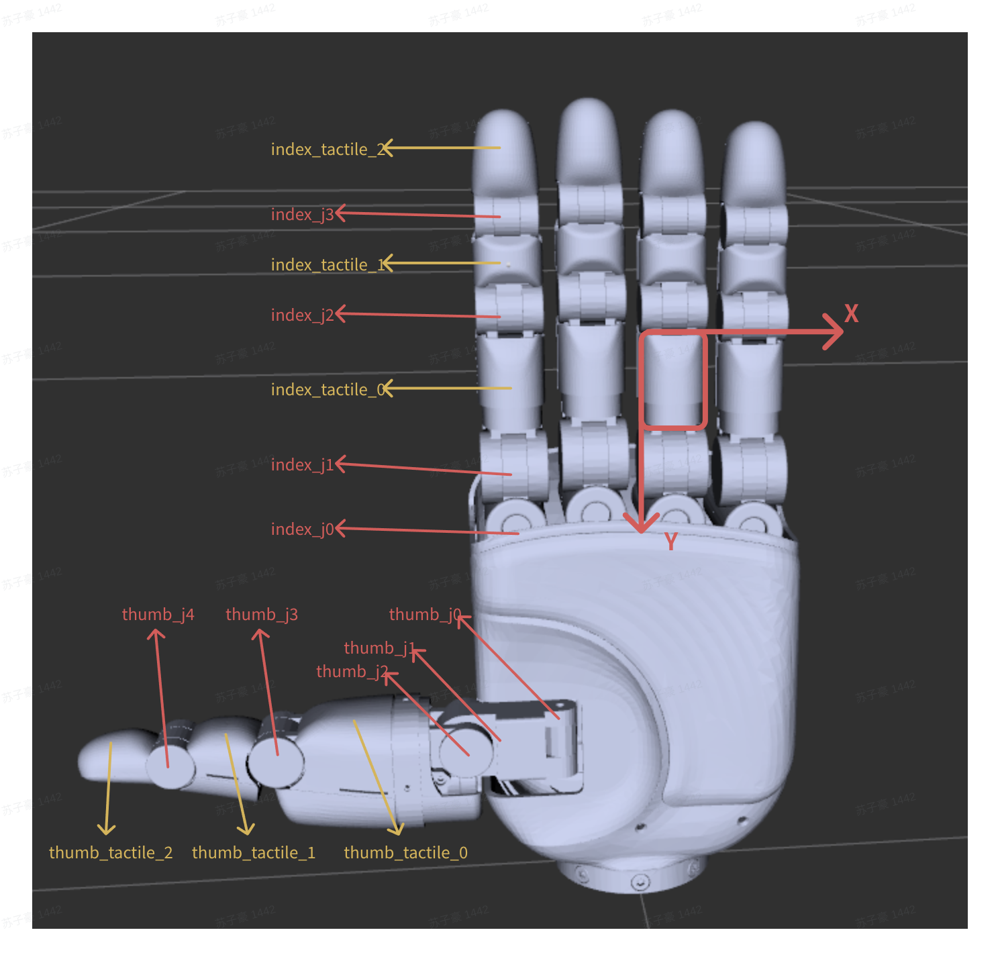

# ApexHand 1.0 Tactile Array Guide

## Introduction

This document describes the tactile array layout and Taxel index mappings for the ApexHand 1.0 dexterous hand.

## Overview

|Finger|Location|Variable|Rows X Columns|Valid Taxels|Invalid Points|Count|
|---|---|---|---|---|---|---|
|Thumb|Proximal phalanx pad|thumb\_tactile\_0|6 X 8|48|0|48|
||Middle phalanx pad|thumb\_tactile\_1|6 X 6|32|4|32|
||Distal phalanx pad|thumb\_tactile\_2|8 X 9|58|14|58|
|Index finger|Proximal phalanx pad|index\_tactile\_0|6 X 6|36|0|36|
||Middle phalanx pad|index\_tactile\_1|4 X 5|14|6|14|
||Distal phalanx pad|index\_tactile\_2|8 X 8|48|16|48|
|Middle finger|Proximal phalanx pad|middle\_tactile\_0|6 X 6|36|0|36|
||Middle phalanx pad|middle\_tactile\_1|4 X 5|14|6|14|
||Distal phalanx pad|middle\_tactile\_2|8 X 8|48|16|48|
|Ring finger|Proximal phalanx pad|ring\_tactile\_0|6 X 6|36|0|36|
||Middle phalanx pad|ring\_tactile\_1|4 X 5|14|6|14|
||Distal phalanx pad|ring\_tactile\_2|8 X 8|48|16|48|
|Little finger|Proximal phalanx pad|pinky\_tactile\_0|6 X 6|36|0|36|
||Middle phalanx pad|pinky\_tactile\_1|4 X 5|14|6|14|
||Distal phalanx pad|pinky\_tactile\_2|8 X 8|48|16|48|
|Palm|Central area|palm\_tactile|14 X 14|89|107|89|
|Total||||619||619|

## Array Mapping Details

The figure below shows the URDF joint and tactile region names. The tactile array outlined in red illustrates the array coordinate directions:



When reading the mapping matrices below, refer to the red coordinate arrows in the figure: the positive X direction points to the right and corresponds to column indices increasing from left to right; the positive Y direction points downward and corresponds to row indices increasing from top to bottom.

> **Positive integer indices are valid indices.**

> **`-1` indicates an invalid sampling point where no sensor is installed. The tactile module does not sample or update this position.**

Of all the array mappings, only the palm mapping differs between the left and right hands. Be sure to select the correct mapping.

### Fingers

#### Thumb Proximal Phalanx Pad (`thumb_tactile_0`)

C\+\+

```C++
const int N_ROWS = 6;
const int N_COLS = 8;

int TaxelIdxReMap[N_ROWS][N_COLS] = {
    { 0,  1,  2,  3,  4,  5,  6,  7},
    { 8,  9, 10, 11, 12, 13, 14, 15},
    {16, 17, 18, 19, 20, 21, 22, 23},
    {24, 25, 26, 27, 28, 29, 30, 31},
    {32, 33, 34, 35, 36, 37, 38, 39},
    {40, 41, 42, 43, 44, 45, 46, 47}
};
```

Python

```Python
import numpy as np

TaxelIdxReMap = np.array([
    [ 0,  1,  2,  3,  4,  5,  6,  7],
    [ 8,  9, 10, 11, 12, 13, 14, 15],
    [16, 17, 18, 19, 20, 21, 22, 23],
    [24, 25, 26, 27, 28, 29, 30, 31],
    [32, 33, 34, 35, 36, 37, 38, 39],
    [40, 41, 42, 43, 44, 45, 46, 47],
], dtype=np.int16)

N_ROWS, N_COLS = TaxelIdxReMap.shape
```

#### Thumb Middle Phalanx Pad (`thumb_tactile_1`)

C\+\+

```C++
const int N_ROWS = 6;
const int N_COLS = 6;

int TaxelIdxReMap[N_ROWS][N_COLS] = {
    {-1,  0,  1,  2,  3, -1},
    { 4,  5,  6,  7,  8,  9},
    {10, 11, 12, 13, 14, 15},
    {16, 17, 18, 19, 20, 21},
    {22, 23, 24, 25, 26, 27},
    {-1, 28, 29, 30, 31, -1}
};
```

Python

```Python
import numpy as np

TaxelIdxReMap = np.array([
    [-1,  0,  1,  2,  3, -1],
    [ 4,  5,  6,  7,  8,  9],
    [10, 11, 12, 13, 14, 15],
    [16, 17, 18, 19, 20, 21],
    [22, 23, 24, 25, 26, 27],
    [-1, 28, 29, 30, 31, -1],
], dtype=np.int16)

N_ROWS, N_COLS = TaxelIdxReMap.shape
```

#### Thumb Distal Phalanx Pad (`thumb_tactile_2`)

C\+\+

```C++
const int N_ROWS = 8;
const int N_COLS = 9;

int TaxelIdxReMap[N_ROWS][N_COLS] = {
    {-1, -1, -1,  0,  1,  2, -1, -1, -1},
    {-1, -1,  3,  4,  5,  6,  7, -1, -1},
    {-1,  8,  9, 10, 11, 12, 13, 14, -1},
    {-1, 15, 16, 17, 18, 19, 20, 21, -1},
    {22, 23, 24, 25, 26, 27, 28, 29, 30},
    {31, 32, 33, 34, 35, 36, 37, 38, 39},
    {40, 41, 42, 43, 44, 45, 46, 47, 48},
    {49, 50, 51, 52, 53, 54, 55, 56, 57}
};
```

Python

```Python
import numpy as np

TaxelIdxReMap = np.array([
    [-1, -1, -1,  0,  1,  2, -1, -1, -1],
    [-1, -1,  3,  4,  5,  6,  7, -1, -1],
    [-1,  8,  9, 10, 11, 12, 13, 14, -1],
    [-1, 15, 16, 17, 18, 19, 20, 21, -1],
    [22, 23, 24, 25, 26, 27, 28, 29, 30],
    [31, 32, 33, 34, 35, 36, 37, 38, 39],
    [40, 41, 42, 43, 44, 45, 46, 47, 48],
    [49, 50, 51, 52, 53, 54, 55, 56, 57],
], dtype=np.int16)

N_ROWS, N_COLS = TaxelIdxReMap.shape
```

#### Index Finger Proximal Phalanx Pad (`index_tactile_0`)

C\+\+

```C++
const int N_ROWS = 6;
const int N_COLS = 6;

int TaxelIdxReMap[N_ROWS][N_COLS] = {
    {0,   1,  2,  3,  4,  5},
    {6,   7,  8,  9, 10, 11},
    {12, 13, 14, 15, 16, 17},
    {18, 19, 20, 21, 22, 23},
    {24, 25, 26, 27, 28, 29},
    {30, 31, 32, 33, 34, 35}
};
```

Python

```Python
import numpy as np

TaxelIdxReMap = np.array([
    [0,   1,  2,  3,  4,  5],
    [6,   7,  8,  9, 10, 11],
    [12, 13, 14, 15, 16, 17],
    [18, 19, 20, 21, 22, 23],
    [24, 25, 26, 27, 28, 29],
    [30, 31, 32, 33, 34, 35],
], dtype=np.int16)

N_ROWS, N_COLS = TaxelIdxReMap.shape
```

#### Index Finger Middle Phalanx Pad (`index_tactile_1`)

C\+\+

```C++
const int N_ROWS = 4;
const int N_COLS = 5;

int TaxelIdxReMap[N_ROWS][N_COLS] = {
    {0,  -1, -1, -1,  1},
    {2,   3,  4,  5,  6},
    {7,   8,  9, 10, 11},
    {12, -1, -1, -1, 13}
};
```

Python

```Python
import numpy as np

TaxelIdxReMap = np.array([
    [0,  -1, -1, -1,  1],
    [2,   3,  4,  5,  6],
    [7,   8,  9, 10, 11],
    [12, -1, -1, -1, 13]
], dtype=np.int16)

N_ROWS, N_COLS = TaxelIdxReMap.shape
```

#### Index Finger Distal Phalanx Pad (`index_tactile_2`)

C\+\+

```C++
const int N_ROWS = 8;
const int N_COLS = 8;

int TaxelIdxReMap[N_ROWS][N_COLS] = {
    {-1, -1, -1,  0,  1, -1, -1, -1},
    {-1, -1,  2,  3,  4,  5, -1, -1},
    {-1,  6,  7,  8,  9, 10, 11, -1},
    {-1, 12, 13, 14, 15, 16, 17, -1},
    {-1, 18, 19, 20, 21, 22, 23, -1},
    {24, 25, 26, 27, 28, 29, 30, 31},
    {32, 33, 34, 35, 36, 37, 38, 39},
    {40, 41, 42, 43, 44, 45, 46, 47}
};
```

Python

```Python
import numpy as np

TaxelIdxReMap = np.array([
    [-1, -1, -1,  0,  1, -1, -1, -1],
    [-1, -1,  2,  3,  4,  5, -1, -1],
    [-1,  6,  7,  8,  9, 10, 11, -1],
    [-1, 12, 13, 14, 15, 16, 17, -1],
    [-1, 18, 19, 20, 21, 22, 23, -1],
    [24, 25, 26, 27, 28, 29, 30, 31],
    [32, 33, 34, 35, 36, 37, 38, 39],
    [40, 41, 42, 43, 44, 45, 46, 47],
], dtype=np.int16)

N_ROWS, N_COLS = TaxelIdxReMap.shape
```

#### Middle Finger Proximal Phalanx Pad (`middle_tactile_0`)

C\+\+

```C++
const int N_ROWS = 6;
const int N_COLS = 6;

int TaxelIdxReMap[N_ROWS][N_COLS] = {
    {0,   1,  2,  3,  4,  5},
    {6,   7,  8,  9, 10, 11},
    {12, 13, 14, 15, 16, 17},
    {18, 19, 20, 21, 22, 23},
    {24, 25, 26, 27, 28, 29},
    {30, 31, 32, 33, 34, 35}
};
```

Python

```Python
import numpy as np

TaxelIdxReMap = np.array([
    [0,   1,  2,  3,  4,  5],
    [6,   7,  8,  9, 10, 11],
    [12, 13, 14, 15, 16, 17],
    [18, 19, 20, 21, 22, 23],
    [24, 25, 26, 27, 28, 29],
    [30, 31, 32, 33, 34, 35],
], dtype=np.int16)

N_ROWS, N_COLS = TaxelIdxReMap.shape
```

#### Middle Finger Middle Phalanx Pad (`middle_tactile_1`)

C\+\+

```C++
const int N_ROWS = 4;
const int N_COLS = 5;

int TaxelIdxReMap[N_ROWS][N_COLS] = {
    {0,  -1, -1, -1,  1},
    {2,   3,  4,  5,  6},
    {7,   8,  9, 10, 11},
    {12, -1, -1, -1, 13}
};
```

Python

```Python
import numpy as np

TaxelIdxReMap = np.array([
    [0,  -1, -1, -1,  1],
    [2,   3,  4,  5,  6],
    [7,   8,  9, 10, 11],
    [12, -1, -1, -1, 13]
], dtype=np.int16)

N_ROWS, N_COLS = TaxelIdxReMap.shape
```

#### Middle Finger Distal Phalanx Pad (`middle_tactile_2`)

C\+\+

```C++
const int N_ROWS = 8;
const int N_COLS = 8;

int TaxelIdxReMap[N_ROWS][N_COLS] = {
    {-1, -1, -1,  0,  1, -1, -1, -1},
    {-1, -1,  2,  3,  4,  5, -1, -1},
    {-1,  6,  7,  8,  9, 10, 11, -1},
    {-1, 12, 13, 14, 15, 16, 17, -1},
    {-1, 18, 19, 20, 21, 22, 23, -1},
    {24, 25, 26, 27, 28, 29, 30, 31},
    {32, 33, 34, 35, 36, 37, 38, 39},
    {40, 41, 42, 43, 44, 45, 46, 47}
};
```

Python

```Python
import numpy as np

TaxelIdxReMap = np.array([
    [-1, -1, -1,  0,  1, -1, -1, -1],
    [-1, -1,  2,  3,  4,  5, -1, -1],
    [-1,  6,  7,  8,  9, 10, 11, -1],
    [-1, 12, 13, 14, 15, 16, 17, -1],
    [-1, 18, 19, 20, 21, 22, 23, -1],
    [24, 25, 26, 27, 28, 29, 30, 31],
    [32, 33, 34, 35, 36, 37, 38, 39],
    [40, 41, 42, 43, 44, 45, 46, 47],
], dtype=np.int16)

N_ROWS, N_COLS = TaxelIdxReMap.shape
```

#### Ring Finger Proximal Phalanx Pad (`ring_tactile_0`)

C\+\+

```C++
const int N_ROWS = 6;
const int N_COLS = 6;

int TaxelIdxReMap[N_ROWS][N_COLS] = {
    {0,   1,  2,  3,  4,  5},
    {6,   7,  8,  9, 10, 11},
    {12, 13, 14, 15, 16, 17},
    {18, 19, 20, 21, 22, 23},
    {24, 25, 26, 27, 28, 29},
    {30, 31, 32, 33, 34, 35}
};
```

Python

```Python
import numpy as np

TaxelIdxReMap = np.array([
    [0,   1,  2,  3,  4,  5],
    [6,   7,  8,  9, 10, 11],
    [12, 13, 14, 15, 16, 17],
    [18, 19, 20, 21, 22, 23],
    [24, 25, 26, 27, 28, 29],
    [30, 31, 32, 33, 34, 35],
], dtype=np.int16)

N_ROWS, N_COLS = TaxelIdxReMap.shape
```

#### Ring Finger Middle Phalanx Pad (`ring_tactile_1`)

C\+\+

```C++
const int N_ROWS = 4;
const int N_COLS = 5;

int TaxelIdxReMap[N_ROWS][N_COLS] = {
    {0,  -1, -1, -1,  1},
    {2,   3,  4,  5,  6},
    {7,   8,  9, 10, 11},
    {12, -1, -1, -1, 13}
};
```

Python

```Python
import numpy as np

TaxelIdxReMap = np.array([
    [0,  -1, -1, -1,  1],
    [2,   3,  4,  5,  6],
    [7,   8,  9, 10, 11],
    [12, -1, -1, -1, 13]
], dtype=np.int16)

N_ROWS, N_COLS = TaxelIdxReMap.shape
```

#### Ring Finger Distal Phalanx Pad (`ring_tactile_2`)

C\+\+

```C++
const int N_ROWS = 8;
const int N_COLS = 8;

int TaxelIdxReMap[N_ROWS][N_COLS] = {
    {-1, -1, -1,  0,  1, -1, -1, -1},
    {-1, -1,  2,  3,  4,  5, -1, -1},
    {-1,  6,  7,  8,  9, 10, 11, -1},
    {-1, 12, 13, 14, 15, 16, 17, -1},
    {-1, 18, 19, 20, 21, 22, 23, -1},
    {24, 25, 26, 27, 28, 29, 30, 31},
    {32, 33, 34, 35, 36, 37, 38, 39},
    {40, 41, 42, 43, 44, 45, 46, 47}
};
```

Python

```Python
import numpy as np

TaxelIdxReMap = np.array([
    [-1, -1, -1,  0,  1, -1, -1, -1],
    [-1, -1,  2,  3,  4,  5, -1, -1],
    [-1,  6,  7,  8,  9, 10, 11, -1],
    [-1, 12, 13, 14, 15, 16, 17, -1],
    [-1, 18, 19, 20, 21, 22, 23, -1],
    [24, 25, 26, 27, 28, 29, 30, 31],
    [32, 33, 34, 35, 36, 37, 38, 39],
    [40, 41, 42, 43, 44, 45, 46, 47],
], dtype=np.int16)

N_ROWS, N_COLS = TaxelIdxReMap.shape
```

#### Little Finger Proximal Phalanx Pad (`pinky_tactile_0`)

C\+\+

```C++
const int N_ROWS = 6;
const int N_COLS = 6;

int TaxelIdxReMap[N_ROWS][N_COLS] = {
    {0,   1,  2,  3,  4,  5},
    {6,   7,  8,  9, 10, 11},
    {12, 13, 14, 15, 16, 17},
    {18, 19, 20, 21, 22, 23},
    {24, 25, 26, 27, 28, 29},
    {30, 31, 32, 33, 34, 35}
};
```

Python

```Python
import numpy as np

TaxelIdxReMap = np.array([
    [0,   1,  2,  3,  4,  5],
    [6,   7,  8,  9, 10, 11],
    [12, 13, 14, 15, 16, 17],
    [18, 19, 20, 21, 22, 23],
    [24, 25, 26, 27, 28, 29],
    [30, 31, 32, 33, 34, 35],
], dtype=np.int16)

N_ROWS, N_COLS = TaxelIdxReMap.shape
```

#### Little Finger Middle Phalanx Pad (`pinky_tactile_1`)

C\+\+

```C++
const int N_ROWS = 4;
const int N_COLS = 5;

int TaxelIdxReMap[N_ROWS][N_COLS] = {
    {0,  -1, -1, -1,  1},
    {2,   3,  4,  5,  6},
    {7,   8,  9, 10, 11},
    {12, -1, -1, -1, 13}
};
```

Python

```Python
import numpy as np

TaxelIdxReMap = np.array([
    [0,  -1, -1, -1,  1],
    [2,   3,  4,  5,  6],
    [7,   8,  9, 10, 11],
    [12, -1, -1, -1, 13]
], dtype=np.int16)

N_ROWS, N_COLS = TaxelIdxReMap.shape
```

#### Little Finger Distal Phalanx Pad (`pinky_tactile_2`)

C\+\+

```C++
const int N_ROWS = 8;
const int N_COLS = 8;

int TaxelIdxReMap[N_ROWS][N_COLS] = {
    {-1, -1, -1,  0,  1, -1, -1, -1},
    {-1, -1,  2,  3,  4,  5, -1, -1},
    {-1,  6,  7,  8,  9, 10, 11, -1},
    {-1, 12, 13, 14, 15, 16, 17, -1},
    {-1, 18, 19, 20, 21, 22, 23, -1},
    {24, 25, 26, 27, 28, 29, 30, 31},
    {32, 33, 34, 35, 36, 37, 38, 39},
    {40, 41, 42, 43, 44, 45, 46, 47}
};
```

Python

```Python
import numpy as np

TaxelIdxReMap = np.array([
    [-1, -1, -1,  0,  1, -1, -1, -1],
    [-1, -1,  2,  3,  4,  5, -1, -1],
    [-1,  6,  7,  8,  9, 10, 11, -1],
    [-1, 12, 13, 14, 15, 16, 17, -1],
    [-1, 18, 19, 20, 21, 22, 23, -1],
    [24, 25, 26, 27, 28, 29, 30, 31],
    [32, 33, 34, 35, 36, 37, 38, 39],
    [40, 41, 42, 43, 44, 45, 46, 47],
], dtype=np.int16)

N_ROWS, N_COLS = TaxelIdxReMap.shape
```

### Central Palm Area (`palm_tactile`)

#### Left Hand

C\+\+

```C++
const int N_ROWS = 14;
const int N_COLS = 14;

int TaxelIdxReMap[N_ROWS][N_COLS] = {
    { 0,  1,  2,  3,  4,  5,  6,  7,  8,  9, -1, -1, -1, -1},
    {10, 11, 12, 13, 14, 15, 16, 17, 18, 19, 20, 21, 22, 23},
    {-1, -1, -1, -1, 24, 25, 26, 27, 28, 29, 30, 31, 32, 33},
    {-1, -1, -1, -1, -1, -1, 34, 35, 36, 37, 38, 39, 40, 41},
    {-1, -1, -1, -1, -1, -1, -1, 42, 43, 44, 45, 46, 47, 48},
    {-1, -1, -1, -1, -1, -1, -1, -1, 49, 50, 51, 52, 53, 54},
    {-1, -1, -1, -1, -1, -1, -1, -1, -1, 55, 56, 57, 58, 59},
    {-1, -1, -1, -1, -1, -1, -1, -1, -1, 60, 61, 62, 63, 64},
    {-1, -1, -1, -1, -1, -1, -1, -1, -1, -1, 65, 66, 67, 68},
    {-1, -1, -1, -1, -1, -1, -1, -1, -1, -1, 69, 70, 71, 72},
    {-1, -1, -1, -1, -1, -1, -1, -1, -1, -1, 73, 74, 75, 76},
    {-1, -1, -1, -1, -1, -1, -1, -1, -1, -1, 77, 78, 79, 80},
    {-1, -1, -1, -1, -1, -1, -1, -1, -1, -1, 81, 82, 83, 84},
    {-1, -1, -1, -1, -1, -1, -1, -1, -1, -1, 85, 86, 87, 88}
};
```

Python

```Python
import numpy as np

TaxelIdxReMap = np.array([
    [ 0,  1,  2,  3,  4,  5,  6,  7,  8,  9, -1, -1, -1, -1],
    [10, 11, 12, 13, 14, 15, 16, 17, 18, 19, 20, 21, 22, 23],
    [-1, -1, -1, -1, 24, 25, 26, 27, 28, 29, 30, 31, 32, 33],
    [-1, -1, -1, -1, -1, -1, 34, 35, 36, 37, 38, 39, 40, 41],
    [-1, -1, -1, -1, -1, -1, -1, 42, 43, 44, 45, 46, 47, 48],
    [-1, -1, -1, -1, -1, -1, -1, -1, 49, 50, 51, 52, 53, 54],
    [-1, -1, -1, -1, -1, -1, -1, -1, -1, 55, 56, 57, 58, 59],
    [-1, -1, -1, -1, -1, -1, -1, -1, -1, 60, 61, 62, 63, 64],
    [-1, -1, -1, -1, -1, -1, -1, -1, -1, -1, 65, 66, 67, 68],
    [-1, -1, -1, -1, -1, -1, -1, -1, -1, -1, 69, 70, 71, 72],
    [-1, -1, -1, -1, -1, -1, -1, -1, -1, -1, 73, 74, 75, 76],
    [-1, -1, -1, -1, -1, -1, -1, -1, -1, -1, 77, 78, 79, 80],
    [-1, -1, -1, -1, -1, -1, -1, -1, -1, -1, 81, 82, 83, 84],
    [-1, -1, -1, -1, -1, -1, -1, -1, -1, -1, 85, 86, 87, 88],
], dtype=np.int16)

N_ROWS, N_COLS = TaxelIdxReMap.shape
```

#### Right Hand

C\+\+

```C++
const int N_ROWS = 14;
const int N_COLS = 14;

int TaxelIdxReMap[N_ROWS][N_COLS] = {
    {-1, -1, -1, -1,  0,  1,  2,  3,  4,  5,  6,  7,  8,  9},
    {10, 11, 12, 13, 14, 15, 16, 17, 18, 19, 20, 21, 22, 23},
    {24, 25, 26, 27, 28, 29, 30, 31, 32, 33, -1, -1, -1, -1},
    {34, 35, 36, 37, 38, 39, 40, 41, -1, -1, -1, -1, -1, -1},
    {42, 43, 44, 45, 46, 47, 48, -1, -1, -1, -1, -1, -1, -1},
    {49, 50, 51, 52, 53, 54, -1, -1, -1, -1, -1, -1, -1, -1},
    {55, 56, 57, 58, 59, -1, -1, -1, -1, -1, -1, -1, -1, -1},
    {60, 61, 62, 63, 64, -1, -1, -1, -1, -1, -1, -1, -1, -1},
    {65, 66, 67, 68, -1, -1, -1, -1, -1, -1, -1, -1, -1, -1},
    {69, 70, 71, 72, -1, -1, -1, -1, -1, -1, -1, -1, -1, -1},
    {73, 74, 75, 76, -1, -1, -1, -1, -1, -1, -1, -1, -1, -1},
    {77, 78, 79, 80, -1, -1, -1, -1, -1, -1, -1, -1, -1, -1},
    {81, 82, 83, 84, -1, -1, -1, -1, -1, -1, -1, -1, -1, -1},
    {85, 86, 87, 88, -1, -1, -1, -1, -1, -1, -1, -1, -1, -1}
};
```

Python

```Python
import numpy as np

TaxelIdxReMap = np.array([
    [-1, -1, -1, -1,  0,  1,  2,  3,  4,  5,  6,  7,  8,  9],
    [10, 11, 12, 13, 14, 15, 16, 17, 18, 19, 20, 21, 22, 23],
    [24, 25, 26, 27, 28, 29, 30, 31, 32, 33, -1, -1, -1, -1],
    [34, 35, 36, 37, 38, 39, 40, 41, -1, -1, -1, -1, -1, -1],
    [42, 43, 44, 45, 46, 47, 48, -1, -1, -1, -1, -1, -1, -1],
    [49, 50, 51, 52, 53, 54, -1, -1, -1, -1, -1, -1, -1, -1],
    [55, 56, 57, 58, 59, -1, -1, -1, -1, -1, -1, -1, -1, -1],
    [60, 61, 62, 63, 64, -1, -1, -1, -1, -1, -1, -1, -1, -1],
    [65, 66, 67, 68, -1, -1, -1, -1, -1, -1, -1, -1, -1, -1],
    [69, 70, 71, 72, -1, -1, -1, -1, -1, -1, -1, -1, -1, -1],
    [73, 74, 75, 76, -1, -1, -1, -1, -1, -1, -1, -1, -1, -1],
    [77, 78, 79, 80, -1, -1, -1, -1, -1, -1, -1, -1, -1, -1],
    [81, 82, 83, 84, -1, -1, -1, -1, -1, -1, -1, -1, -1, -1],
    [85, 86, 87, 88, -1, -1, -1, -1, -1, -1, -1, -1, -1, -1],
], dtype=np.int16)

N_ROWS, N_COLS = TaxelIdxReMap.shape
```
